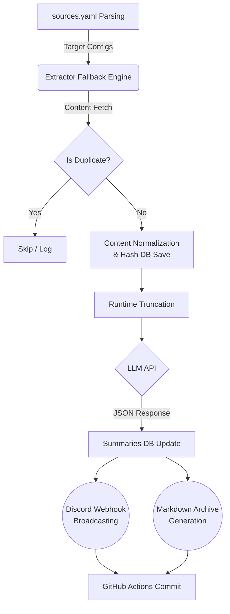

# Knowledge Ingestion Pipeline 🚀

정보기술(IT) 트렌드 파악 및 전문 지식 수집을 완벽하게 자동화하기 위한 "엔지니어링 코어 파이프라인"입니다.
하루에도 쏟아지는 수백 개의 뉴스, 블로그, 이슈들을 수집하고, 중복을 제거하며, 안전하게 가공한 후, LLM(GPT)의 인지 능력을 거쳐 중요한 인사이트만 디스코드 카드로 정리하여 전송합니다.

## 🔥 차별화 포인트 (Key Features)
1. **완벽한 중복 방지 (Deduplication):** 
   - `url_hash`: 기사 URL에 붙어있는 마케팅 추적 코드(`utm_source` 등)을 벗겨내고 순수한 본질(Canonical) 링크만 비교합니다.
   - `content_hash`: URL이 다르더라도(리포스팅 등) 내용이 같으면 스킵합니다. HTML과 공백을 걷어낸 순수 텍스트의 앞 1,000자로 해시를 비교합니다.
2. **Extraction Fallback (추출 방어 체계):**
   - 크롤링 봇을 차단하는 사이트에 대비해 `Crawl4AI(기본) → Firecrawl(차단우회) → RSS원본(보루)` 3단계 순차 추락 방지 엔진을 달았습니다.
3. **Structured Intelligence (LLM 구조화):**
   - LLM이 자유롭게 떠들지 못하도록, Pydantic을 활용하여 강제로 정해진 JSON (중요도 1~10, 3줄 요약, 핵심 포인트, 해시태그) 포맷만 응답하게 가두었습니다.

---

## 🏗 아키텍처 흐름 (Pipeline Flow)



---

## 📂 파일 및 폴더 구조 (Project Structure)
- `sources.yaml`: 우리가 구독할 타겟 사이트들과 카테고리, 우선순위를 정의하는 단일 진실 공급원입니다.
- `src/config/`: yaml 파일을 읽어 들여 파이프라인이 소화할 수 있는 리스트로 변경해 줍니다.
- `src/db/`: DB 인프라가 0원일 수 있도록, Git에 커밋이 가능한 `SQLite` 구조체를 관리합니다.
- `src/extractor/`: 크롤러 엔진들이 위치합니다.
- `src/llm/`: OpenAI 등 LLM API를 찌르고, 정제된 답변을 받아오는 로직이 담겨있습니다.
- `src/processor/`: 해시를 생성하고 중복을 걸러내는 뇌(Brain) 역할을 합니다.
- `src/distribution/`: 디스코드에 알림을 빵빵하게 쏴주거나 폴더에 예쁘게 마크다운으로 백업합니다.
- `logs/`: 파이프라인이 돌다가 어디서 막혔는지 세세하게 기록해 주는 `.log` 파일 방입니다.

---

## 🛠 실행 방법 (Usage)

### 1. 로컬 환경 (Local Development)
본 파이프라인은 로컬에서 즉시 트리거 하거나 수정 후 검증할 수 있습니다.
```bash
# 1. 가상환경 생성 및 활성화
python -m venv venv
source venv/bin/activate  # (Windows: .\venv\Scripts\activate.ps1)

# 2. 패키지 설치
pip install -r requirements.txt

# 3. 환경 변수 세팅
export OPENAI_API_KEY="sk-..."
export DISCORD_WEBHOOK_URL="https://discord.com/api/webhooks/..."

# 4. (추후 추가될) 메인 파이프라인 수동 실행
python src/pipeline/main_pipeline.py
```

### 2. 프로덕션 환경 (Production / GitHub Actions)
별도의 서버 구축 없이, `GitHub Actions`를 통해 **매일 07:00 KST (22:00 UTC)**에 배치가 일괄 실행됩니다.
- 레포지토리를 Fork / Clone 하신 후 Repository `Settings > Secrets and variables > Actions` 에 이동합니다.
- `OPENAI_API_KEY` 값과 `DISCORD_WEBHOOK_URL` 값을 등록해 주세요.
- 실행 과정에서 누적되는 DB 데이터(`test.db`)와 `docs/` 리포트 파일들은 Actions 봇이 알아서 Commit & Push 해줍니다. (주의: DB 충돌 방지를 위해 Concurrency 룰이 적용되어 있어 두 배치가 동시 실행되지 않습니다)
